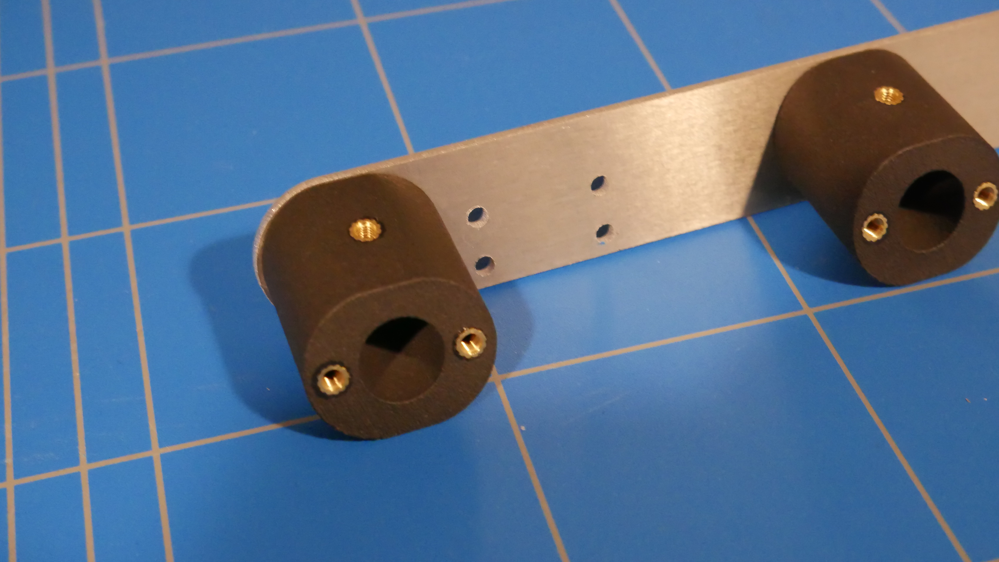
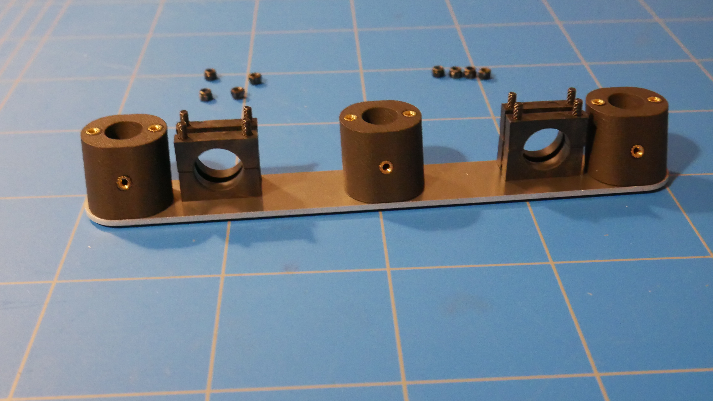

# Step 2: Legs

### Step 0: Read the Key Preparations

Please read through [Carbon Fibre Cutting](../../carbon-fibre-cutting.md) really carefully as carbon fibre particles are extremely bad for your health!

### Step 1: Measure Leg Rods

<figure><figcaption></figcaption></figure>

Measure the 16 mm diameter Carbon Tube to the size choosen in the configurator.

### Step 2: Cut Leg Rods to size

<figure><figcaption></figcaption></figure>

Cut the 16 mm diameter Carbon Tube to the size choosen in the configurator.

### Step 3: Measure Feet Rods

<figure><figcaption></figcaption></figure>

Measure the 10 mm diameter Carbon Tube to the size choosen in the configurator.

### Step 4: Cut Feet Rods to size

<figure><figcaption></figcaption></figure>

Cut the 10 mm diameter Carbon Tube to the size choosen in the configurator.

### Step 5: Measure Battery Mount Rods

<figure><figcaption></figcaption></figure>

Measure the 12 mm diameter Carbon Tube to the size choosen in the configurator.

### Step 6: Cut Battery Mount Rods to size

<figure><figcaption></figcaption></figure>

Cut the 12 mm diameter Carbon Tube to the size choosen in the configurator.

### Step 7: Clean the cuts

Before starting here please read through [Sanding, Carbon Fibre Cutting.  ](../../carbon-fibre-cutting.md#sanding)

Start by using medium grit sandpaper (240 grit) and work up to fine grit sandpaper (400 grit) to smooth the rough edges. Make sure to use wet sandpaper as this will collect some of the carbon dust.  Hold the sandpaper flat against the cut edge and sand lightly in a circular motion, rotating the tube as you go. Avoid pressing too hard, as you can damage the fibers.

### Step 6: Left Leg Bracket Holder Plate

<figure><figcaption></figcaption></figure>

Attach the seperators using <mark style="color:red;">6 M3 10 mm bolts.</mark>&#x20;


Make sure the seperators and the strip are oriented in the way shown below!


<figure><figcaption></figcaption></figure>

### Step 7: Left Leg Brackets

<figure><figcaption></figcaption></figure>

Attach the leg brackets as shown above using 8 M3 50 mm Bolts.&#x20;

### Step 8: Left Leg Bracket Holder Plate 2

<figure><figcaption></figcaption></figure>

Bolt the strip to the strip seperator using <mark style="color:red;">6 M3 10 mm bolts.</mark>&#x20;

Handthighten the leg brackets to the strip using <mark style="color:purple;">8 M3 Lock Nuts.</mark>&#x20;

### Step 9: Right Leg Bracket Holder Plate&#x20;

<figure><figcaption></figcaption></figure>

Attach the seperators using <mark style="color:red;">6 M3 10 mm bolts.</mark>&#x20;


Make sure the seperators and the strip are oriented in the way shown below!


_**Maak nieuwe foto!**_

<figure><figcaption></figcaption></figure>

### Step 10: Right Leg Brackets

Attach the leg brackets as shown above using 8 M3 50 mm Bolts.&#x20;

### Step 11: Right Leg Bracket Holder Plate 2

<figure><figcaption></figcaption></figure>

Bolt the strip to the strip seperator using <mark style="color:red;">6 M3 10 mm bolts.</mark>&#x20;

Handthighten the leg brackets to the strip using <mark style="color:purple;">8 M3 Lock Nuts.</mark>&#x20;

