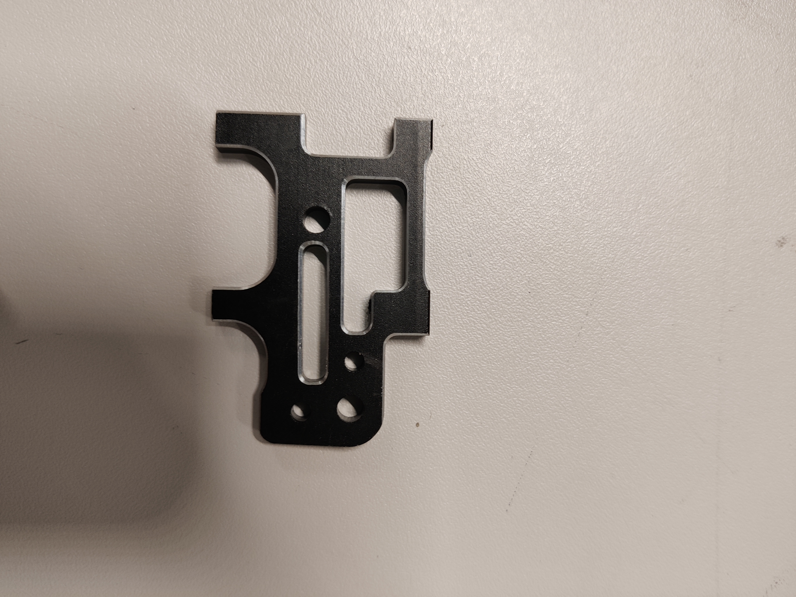
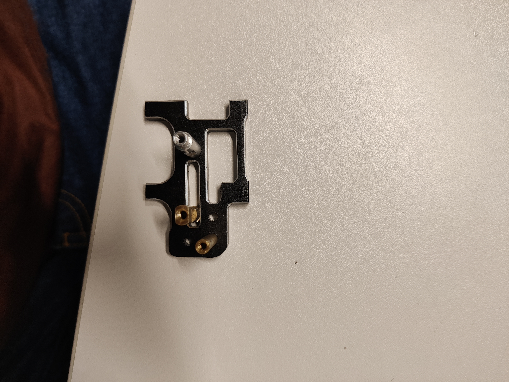
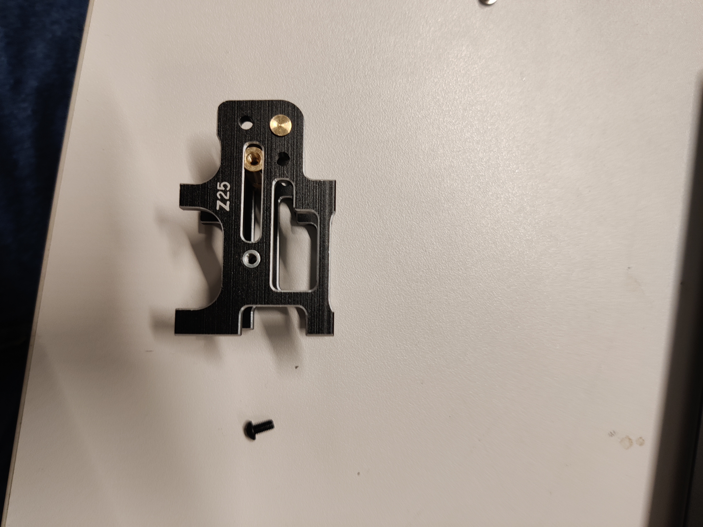
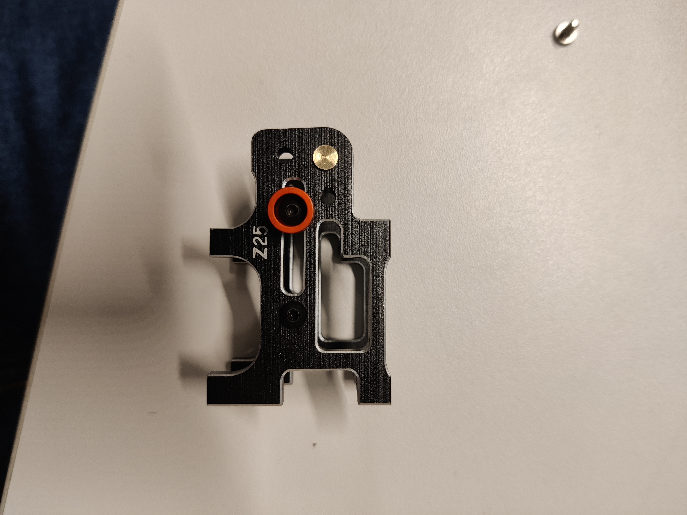
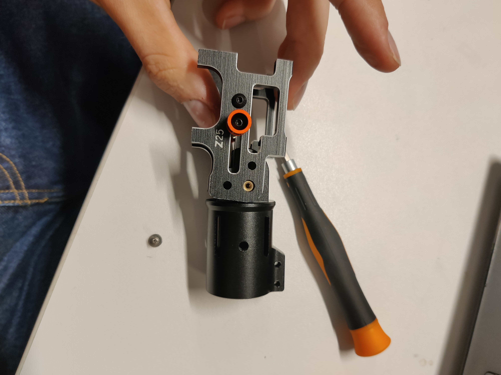
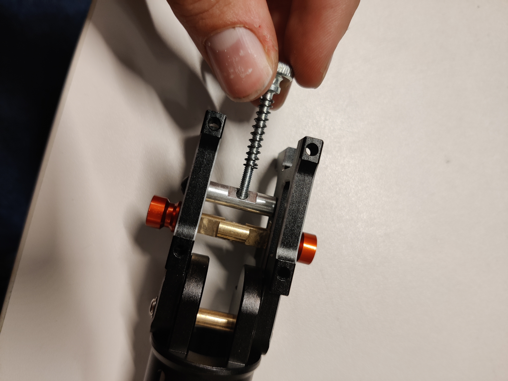
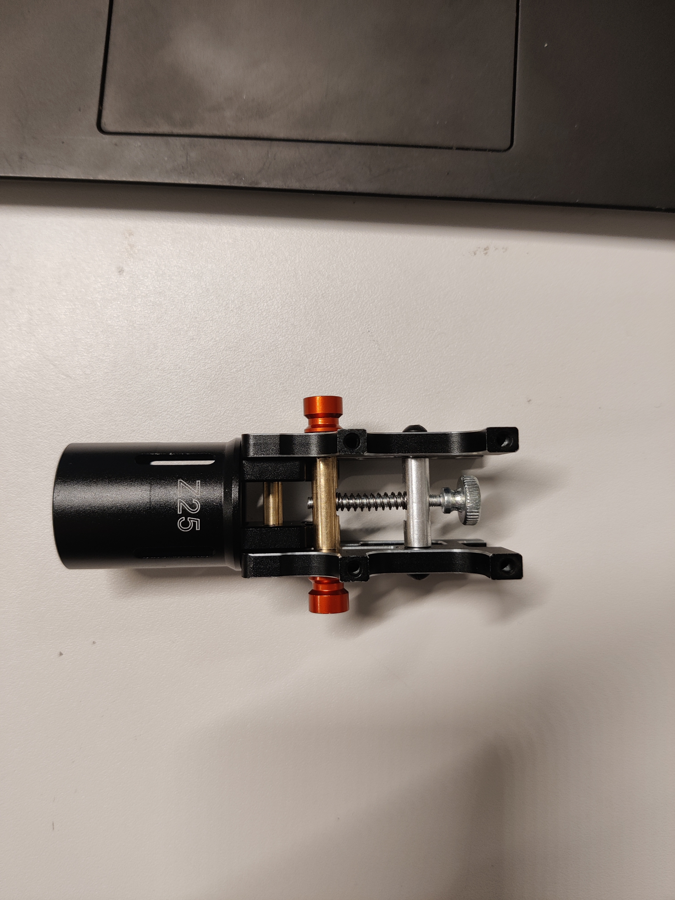
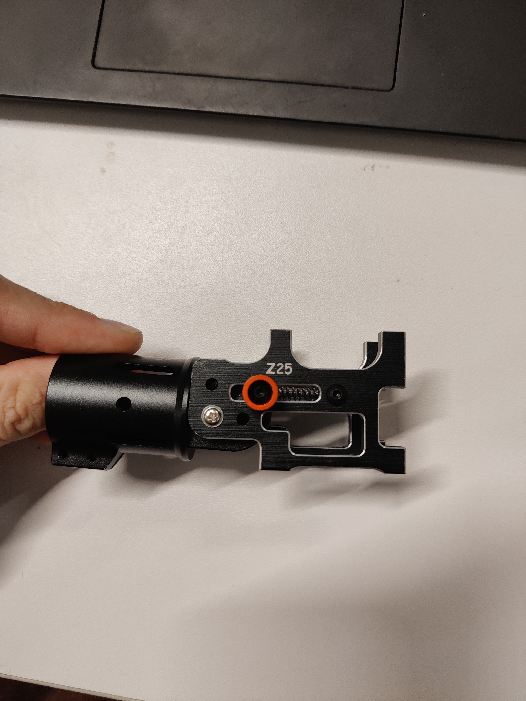

# Step 3: Foldable arm mount

<figure><figcaption></figcaption></figure>

### Parts List

* **1** Brass Axle
* **1** Brass Push Rod
* **1** Aluminum Rod
* **2** Aluminum Milled Mounts
* **1** Axle Mount
* **2** Red Push Rod Accessories
* **1** Spring
* **1** Spring Screw
* <mark style="color:orange;">**1**</mark> <mark style="color:orange;"></mark><mark style="color:orange;">Philips Head Screw</mark>
* <mark style="color:purple;">**2**</mark> <mark style="color:purple;"></mark><mark style="color:purple;">M2 10 mm Bolts</mark>
* <mark style="color:purple;">**2**</mark> <mark style="color:purple;"></mark><mark style="color:purple;">M2 20 mm Bolts</mark>

#### Tools Needed

* <mark style="color:orange;">Philips Head Screwdriver</mark>
* <mark style="color:purple;">M2 Hex Key</mark>
* <mark style="color:red;">Debur Tool</mark>

<figure><figcaption></figcaption></figure>

### **1. Deburr the Milled Parts**

Carefully deburr the edges using <mark style="color:red;">**the Debur Tool**</mark> of the aluminum milled parts to ensure smooth assembly.

***

<figure><figcaption></figcaption></figure>

### 2. Insert the axles

\
Position the brass axles into the holes of the aluminum milled mounts, ensuring the correct orientation as shown in the diagram.

***

<figure><figcaption></figcaption></figure>

### 3. Add the Second Milled Part

Align the second aluminum milled mount with the axles and securely attach it using one of the <mark style="color:purple;">**M2 10 mm bolts**</mark>.

***

<figure><figcaption></figcaption></figure>

### 4. Attach the Red Axle Handle

Fasten the red axle handle to the assembly using one of the <mark style="color:purple;">**M2 20 mm bolts**</mark>.

***

<figure><figcaption></figcaption></figure>

### 5. Insert the Axle Holder

Position the axle holder into its designated space.

***

<figure><figcaption></figcaption></figure>

### 6. Insert the Spring Screw

Take the spring screw and insert it through the assembly. Make sure to place the spring between the aluminum rod and the brass axle.

***

<figure><figcaption></figcaption></figure>

### 7. Secure the Spring Screw

Tighten the spring screw until the end of the screw is visible through the brass axle.

***

<figure><figcaption></figcaption></figure>

### **8. Final Check**

Ensure the axle holder locks into place correctly. If it does not lock, review the assembly steps and ensure all components are properly installed.

### 9. Repeat

Repeat this step for each arm purchased.

