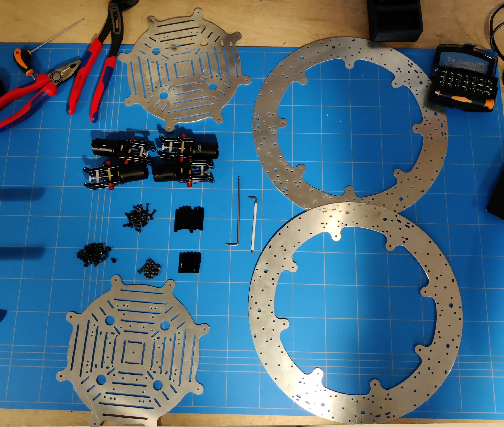
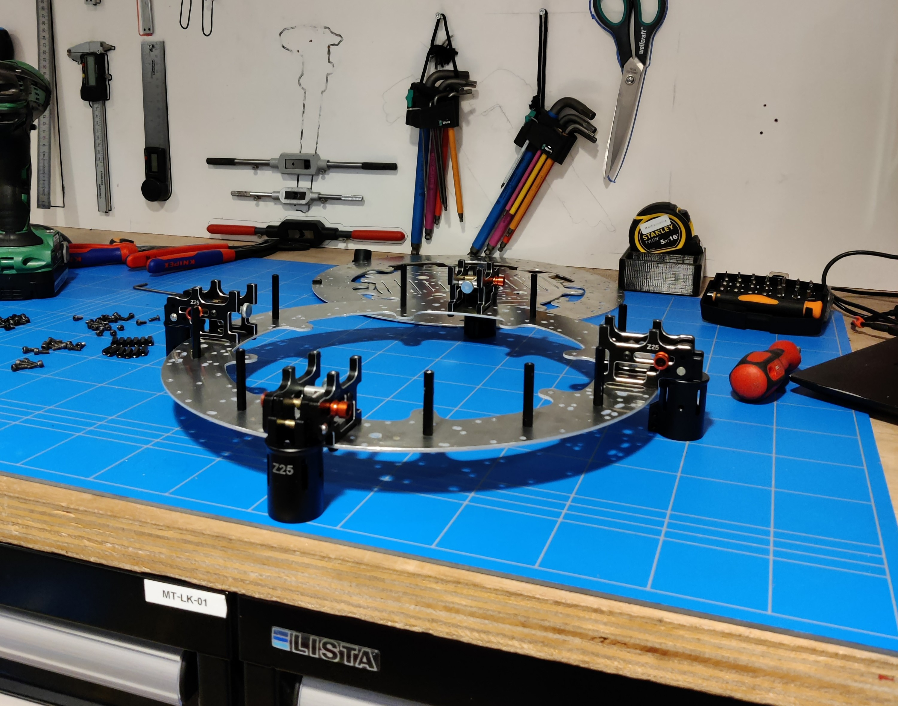
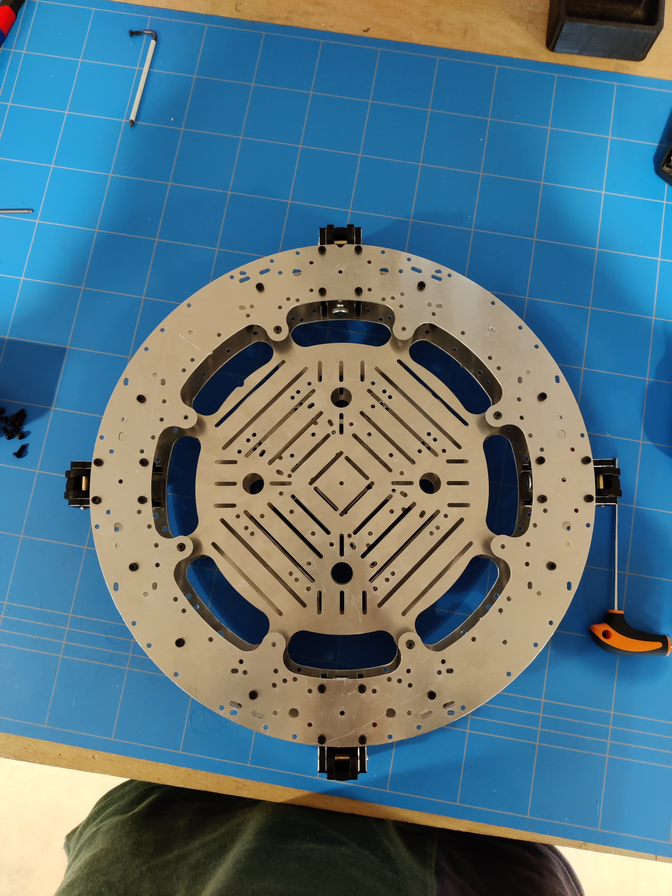

# Step 4: Body&#x20;

<figure><figcaption></figcaption></figure>

## Components list &#x20;

* [ ] 2x Aluminium Main Frame
* [ ] 2x Aluminium Electronics Plate
* [ ] 4x Foldable Arm Mounts
* [ ] 4x Leg Mounts
* [ ] 10x 35 mm dividers
* [ ] 16x 10 mm dividers
* [ ] <mark style="color:red;">84x M3 Socket Head Bolt</mark>

### Step 1: Debur all Aluminum Plates

<figure><figcaption></figcaption></figure>

Debur all the Aluminum Plates using the techniques shown in [Debur Key Preparations](../../deburring.md)

### Step 2: Attach 35 mm Dividers to bottom plate

<figure><figcaption></figcaption></figure>

Attach the 35 mm dividers using <mark style="color:red;">the M3 Socket Head Bolt</mark> to the holes shown above.

### Step 3: Attach Arm Mounts

<figure><figcaption></figcaption></figure>

 

<figure><figcaption></figcaption></figure>

Attach the Arm Mounts using <mark style="color:red;">the M3 Socket Head Bolt</mark> to the holes shown above.

### Step 4: Attach Bottom Electronics Plate

<figure><figcaption></figcaption></figure>

Attach the 10 mm dividers using <mark style="color:red;">the M3 Socket Head Bolt</mark> to the holes shown above.

### Step 5: Attach Leg Mounts

<figure><figcaption></figcaption></figure>

Attach the Leg Mounts using the bolts with it to the holes shown above.

### Step 6: Attach Top Electronics Plate to Top Plate

<figure><figcaption></figcaption></figure>

 

<figure><figcaption></figcaption></figure>

Attach the 10 mm dividers using <mark style="color:red;">the M3 Socket Head Bolt</mark> to the holes shown above.

### Step 7: Attach Top to Bottom Plate

<figure><figcaption></figcaption></figure>

Attach the top to the bottom plate using <mark style="color:red;">the M3 Socket Head Bolt.</mark>

