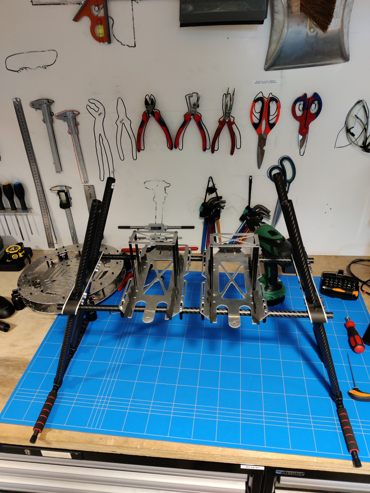

# Step 7: Final Assembly

### Components list

* [x] 2x Feet Assembly
* [ ] x Battery Mount Assembly
* [ ] 1x Body Assembly
* [ ] 1x Strip L
* [ ] 1x Strip R
* [ ] 4x Carbon Tube 16 mm
* [ ] 2x Carbon Tube 12 mm&#x20;
* [ ] 2x Carbon Tube 10 mm

### Step 1: Attach 12 mm Tube to Battery Mount

<figure><figcaption></figcaption></figure>

 

<figure><figcaption></figcaption></figure>

Slide the 12 mm tubes through the carbon mounts on the bottom of the Battery Mounts.&#x20;

### Step 2: Attach Legs to Strips

<figure><figcaption></figcaption></figure>

Slide the 16 mm tubes through Strip L and R.&#x20;

### Step 3: Attach Feet Assembly to 16 mm Carbon

<figure><figcaption></figcaption></figure>

Slide the 16 mm tubes into the feet assembly.

### Step 4: Attach Feet Assembly to Battery Mount Assembly

<figure><figcaption></figcaption></figure>

 

<figure><figcaption></figcaption></figure>

Slide the 12 mm tubes into the strip L and R.&#x20;

### Step 5: Attach Battery Mount Assembly to Body Assembly

<figure><figcaption></figcaption></figure>

Slide the 12 mm tubes into the strip L and R.&#x20;

### Step 6: Check for Vertical Legs

<figure><figcaption></figcaption></figure>

Check if the legs are in all the way and the feet are stable on the ground.

### Step 7: Thigthen Set Screw Strip Dividers

<figure><figcaption></figcaption></figure>

Thighten the screws shown above untill you feel resistance.&#x20;

### Step 8: Check Distance between Battery Mounts

<figure><figcaption></figcaption></figure>

Check the distance between the batterymounts and adjust it where necesarry.&#x20;

### Step 9: Thigthen Battery Mount Carbon Tubes Mounts

<figure><figcaption></figcaption></figure>

Thighten the screws of the carbon tube mounts using a <mark style="color:red;">size 2 Allen Key.</mark>
