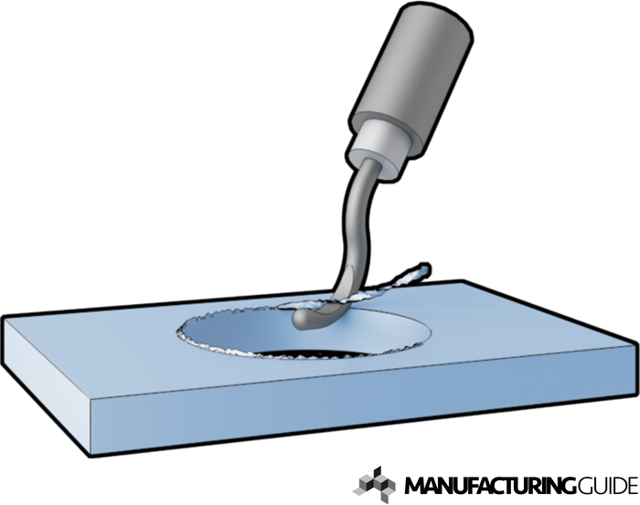

# Deburring

Background information on deburring

Various machining processes can produce undesired burrs on workpieces of all kinds. Not only are these imperfections unattractive, but they can also negatively affect the performance and safety of the part or component. In these situations, deburring machines can be used to remove burrs and produce smooth, high-quality parts with optimal functionality. Here, we will discuss deburring, how it works, when it’s used, and how Apex Machine Group can help with your deburring needs.

### What is Deburring?

Deburring is a type of secondary process that occurs after machining operations. This process removes unwanted pieces of material, known as burrs, as well as any raised edges left behind by machining to enhance the overall quality of the final product. Machining processes that produce burrs include compressing, piercing, cutting, bending, and shearing.

Deburring is crucial for many applications, as burrs can affect a part’s overall effectiveness, safety, longevity, and functionality. When left unaccounted for, burrs can cause the following issues:

* Material and fastener issues
* Increased stress in certain areas, resulting in decreased resistance to fractures
* Shortened fatigue life
* Improper seating of fasteners, which can lead to assembly or fastener damage
* Material failure caused by cracks
* Higher risk of corrosion
* Increased risk of static discharge due to concentrated electrical charge
* Undesired heat and friction
* Unsafe handling
* Lubrication issues caused by increased wear at interface

Deburring can be accomplished in several ways, depending on component geometry, burr location and size, material, product volume, and cost. The following are some of the common deburring techniques:

* **Mass Finishing.** This procedure is useful when numerous parts or components need to be finished. It can be done in batch or continuous systems, and in dry or wet processes, depending on the product material.
* **Brushing.** Burrs are scraped off with brushes composed of thin wires or metal filaments attached to a revolving disc.
* **Manual Deburring.** This deburring method uses hand-held or mechanical instruments, such as brushes, grinders, sanders, and files, among others.
* **Robotic Deburring.** Robotic deburring involves a robotic arm with a grinding, deburring, or chamfering tool mounted on it.
* **Sheet Metal Edging.** Sheet metal edging equipment features pinch rollers or small grinding wheels that smooth the edges of sheet metal with thicknesses ranging between 0.025 to 0.25 inches.
* **Mechanical Deburring.** Mechanical deburring involves the use of machines to deburr the workpiece. Compared to manual deburring, mechanical deburring offers less control over localization and aggressiveness.
* **Electrochemical Deburring.** For applications requiring extreme precision and the removal of burrs from hard-to-reach areas, electrochemical deburring offers the ideal solution. It uses a combination of electricity and a glycol or salt solution to dissolve the burrs without affecting the rest of the material.
* **Waterjet Deburring.** Burrs and debris are eroded from the workpiece using the impact force of high-velocity water jets.

[https://apexmachinegroup.com/resources/blog/the-ultimate-guide-to-deburring/](https://apexmachinegroup.com/resources/blog/the-ultimate-guide-to-deburring/)

### How to deburr

After laser cutting, the aluminum parts may have sharp edges or burrs that need to be removed. This is done using a deburring tool, which is shown below. The tool has an articulating head with a sharp edge designed to scrape away metal burrs.

#### Steps to Deburr:

1. Hold the deburring tool firmly.
2. Place the sharp edge of the tool against the burred edge of the aluminum part.
3. Apply moderate pressure and smoothly glide the tool along the edge, ensuring the burrs are removed.
4.  Continue along the entire edge until it feels smooth and free of any sharp or rough spots.&#x20;

    <mark style="color:red;">**!! CAUTION with this step as the burs are sharp and can easily cut through skin. !!**</mark>

Repeat the process for all edges that require deburring to ensure safety and a clean finish.

<figure><figcaption></figcaption></figure>

