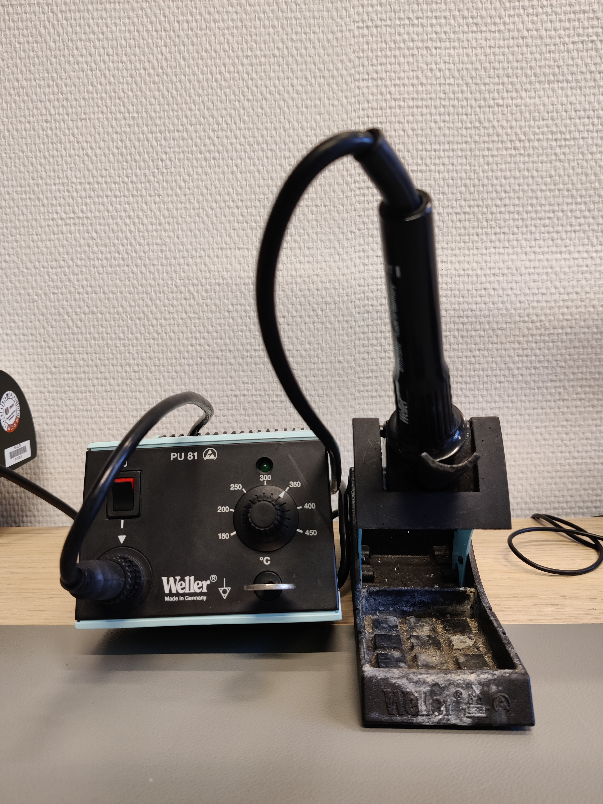
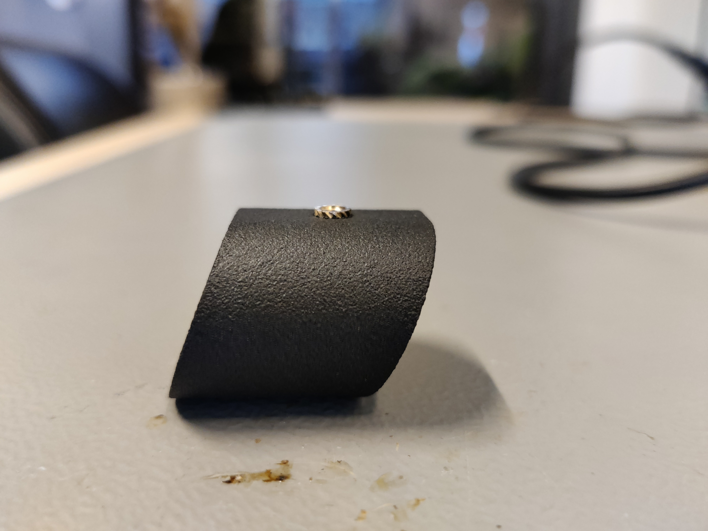
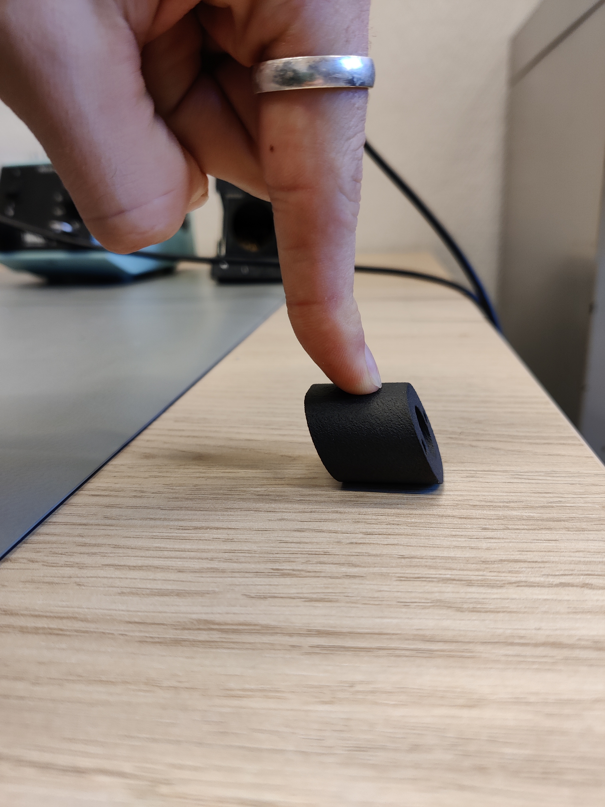
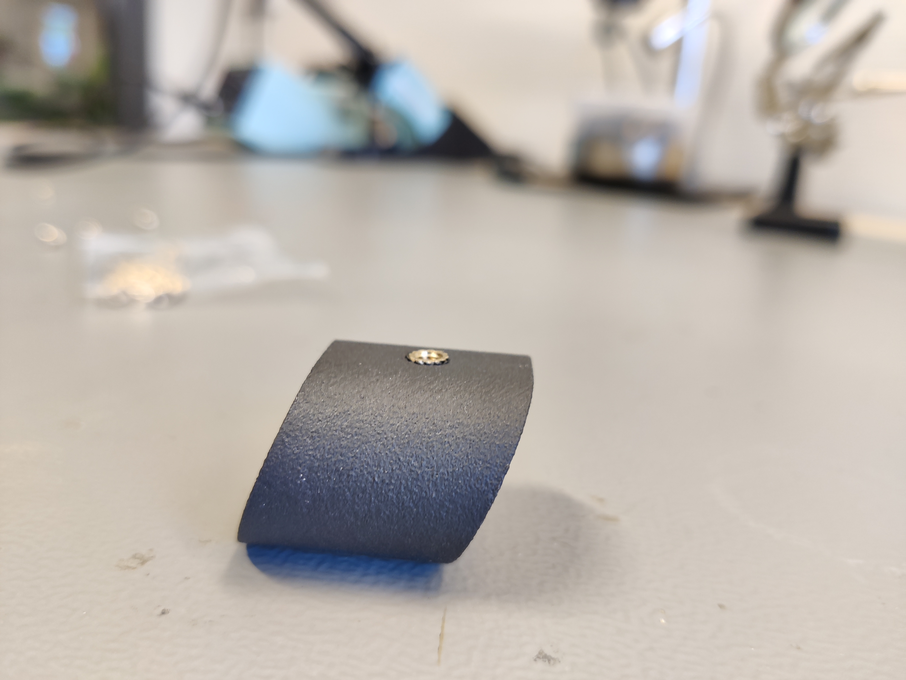

# Heated inserts

What are Heated Inserts?

Heat-set inserts are stock parts that add threads to any part made from a thermoplastic, in order to accept bolts and screws. These inserts are very useful for creating strongly fastened 3D printed parts and enclosures.

Also sometimes referred to as threaded inserts, heat-set inserts work by softening the surrounding material as they are being installed. Once a heat-set insert is installed, the plastic surrounding the insert is locally stronger, and establishes a secure bond between the metal insert and the thermoplastic.

## How to use heated inserts?


Please read through all the steps first as some parts are timing based.&#x20;


#### Step 1: Turn on soldering iron

<figure><figcaption></figcaption></figure>

 

<figure><figcaption>
Special Tip
</figcaption></figure>

Set the soldering iron to 350°C and use a special tip designed for inserting heated inserts. This tip perfectly fits inside the insert, making the process easier compared to using a conical tip. However, a conical tip will work adequately

#### Step 2: Inserting the heated insert in the part.

<figure><figcaption></figcaption></figure>

Put the heated insert in the hole you want to add a heated insert to.&#x20;

#### Step 3: Apply heat and pressure to the insert.

<figure><figcaption></figcaption></figure>

Now gently apply some pressure with the soldering iron. The plastic around the insert will start melting, due to the heat added. This will be noticable as the insert will start moving into the part. Make sure the insert goes down straight.&#x20;

#### Step 4: Stop at 1 mm.

<figure><figcaption></figcaption></figure>

Stop pressing down when the heated insert is about 1 mm above to surface it needs to be flush with.&#x20;

#### Step 5: Turn the part around.

<figure><figcaption></figcaption></figure>

Turn the part around quickly and firmly press down on a flat surface. This will make sure the insert is in straight and flush with the surface.&#x20;

#### Step 6: Check if it is straight

<figure><figcaption></figcaption></figure>

The final parts should look like the part shown above. With the insert being flush with the surface.&#x20;

If this is not the case gently apply some heat and correct it. This is not an exact science, being of by a few tenths of a millimeter is fine here, as long as the heated insert is inserted straight.&#x20;
