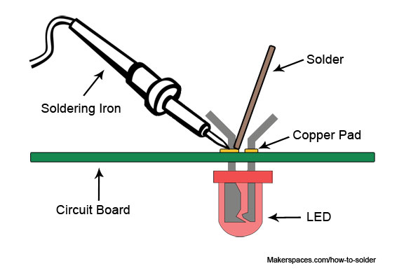

# Soldering

What Is Soldering?

If you were to take apart any electronic device that contains a circuit board, you’ll see the components are attached using soldering techniques. Soldering is the process of joining two or more electronic parts together by melting solder around the connection. Solder is a metal alloy and when it cools it creates a strong electrical bond between the parts. Even though soldering can create a permanent connection, it can also be reversed using a desoldering tool as described below.

Which tools are needed?

## Soldering Tools

The good thing about learning how to solder is the fact that you don’t need a lot to get started. Below we’ll outline the basic tools and materials you will need for most of your soldering projects.

### Soldering Iron

A [soldering iron](https://www.amazon.com/Weller-WLC100-40-Watt-Soldering-Station/dp/B000AS28UC/) is a hand tool that plugs into a standard 230v AC outlet and heats up in order to melt solder around electrical connections. This is one of the most important tools used in soldering and it can come in a few variations such as pen or gun form. For beginners, it’s recommended that you use the pen style soldering iron in the 15W to 30W range. Most soldering irons have interchangeable tips that can be used for different soldering applications, examples will be given below. Be very cautious when using any type of soldering iron because it can heat up to 480 °C which is extremely hot.

### Soldering Station

A [soldering station](https://www.vellemanstore.com/en/velleman-vtssc40nu-soldering-station-with-lcd-ceramic-heater) is a more advanced version of the basic standalone soldering pen. If you are going to be doing a lot of soldering, these are great to have as they offer more flexibility and control. The main benefit of a soldering station is the ability to precisely adjust the temperature of the soldering iron which is great for a range of projects. These stations can also create a safer workspace as some include advanced temperature sensors, alert settings and even password protection for safety.

### Soldering Iron Tips

At the end of most soldering irons is an interchangeable part known as a soldering tip. There are many variations of this tip and they come in a wide variety of shapes and sizes. Each tip is used for a specific purpose and offers a distinct advantage over another. The most common tips you will use in electronics projects are the [conical tip](https://www.sparkfun.com/products/10721) and the [chisel tip](https://www.sparkfun.com/products/10720).

**Conical Tip** – Used in precision electronics soldering because of the fine tip. Because of its pointed end, it’s able to deliver heat to smaller areas without affecting its surroundings.

**Chisel Tip** – This tip is well-suited to soldering wires or other larger components because of its broad flat tip.

### Brass or Conventional Sponge

Using a sponge will help to keep the soldering iron tip clean by removing the oxidation that forms. Tips with oxidation will tend to turn black and not accept solder as it did when it was new. You could use a conventional wet sponge but this tends to shorten the lifespan of the tip due to expansion and contraction. Also, a wet sponge will drop the temperature of the tip temporarily when wiped. A better alternative is to use a [brass sponge](https://www.adafruit.com/product/1172) as shown on the left.

### Soldering Iron Stand

A [soldering iron stand](https://www.adafruit.com/product/150) is very basic but very useful and handy to have. This stand helps prevent the hot iron tip from coming in contact with flammable materials or causing accidental injury to your hand. Most soldering stations come with this built in and also include a sponge or brass sponge for cleaning the tip.

### Solder

Solder is a metal alloy material that is melted to create a permanent bond between electrical parts. It comes in both lead and lead-free variations with diameters between 0.5 mm and 1.5 mm being the most common. Inside the solder core is a material known as flux which helps improve electrical contact and its mechanical strength.

For electronics soldering, the most commonly used type is [lead-free rosin core solder](http://www.jameco.com/z/209074-R-1-Pound-Lead-Free-Solder-Roll-99-3Sn-0-7Cu-0-031-Inch-Diameter\_209075.html). This type of solder is usually made up of a Tin/Copper alloy. You can also use leaded 60/40 (60% tin, 40% lead) rosin core solder but it’s becoming less popular due to health concerns. If you do use lead solder, make sure you have proper ventilation and that you wash your hands after use.

When buying solder, make sure NOT to use acid core solder as this will damage your circuits and components. Acid core solder is sold at home improvement stores and is mainly used for plumbing and metal working.

As mentioned earlier, solder does come in a few different diameters. The thicker diameter solder is good for soldering larger joints more quickly but it can make soldering smaller joints difficult. For this reason, it’s always a good idea to have both sizes on hand for your different projects.

### Helping Hand (Third Hand)

A [helping hand](https://www.sparkfun.com/products/9317) is a device that has 2 or more alligator clips and sometimes a magnifying glass/light attached. This clips will assist you by holding the items you are trying to solder while you use the soldering iron and solder. A very helpful tool to have in your makerspace.

## Soldering Safety

Now that you know what tools and materials are required, it’s time to briefly discuss ways of staying safe while soldering.

Soldering irons can reach temperatures of 480 °C so it’s very important to know where your iron is at all times. We always recommend you use a soldering iron stand to help prevent accidental burns or damage.

Make sure you are soldering in a well ventilated area. When solder is heated, there are fumes released that are harmful to your eyes and lungs. It’s recommended to use a [fume extractor](https://www.walmart.com/ip/1000l-Adjustable-Solder-Smoke-Absorber-Remover-Fume-Extractor-Carbon-Filter-Quiet-Fan-for-ESD-Soldering-Station/184014434) which is a fan with a charcoal filter that absorbs the harmful solder smoke.

It’s always a good idea to wear protective eye wear in case of accidental splashes of hot solder. Lastly, make sure to wash your hands when done soldering especially if using lead solder.

## How to Solder

### Tinning The Tip

Before you can start soldering, you need to prep your soldering iron by tinning the tip with solder. This process will help improve the heat transfer from the iron to the item you’re soldering. Tinning will also help to protect the tip and reduce wear.

**Step 1:** Begin by making sure the tip is attached to the iron and screwed tightly in place.

**Step 2:** Turn on your soldering iron and let it heat up. If you have a soldering station with an adjustable temp control, set it to 400′ C/ 752′ F.

**Step 3:** Wipe the tip of the soldering iron on a damp wet sponge or brass pad to clean it. Wait a few seconds to let the tip heat up again before proceeding to step 4.

**Step 4:** Hold the soldering iron in one hand and solder in the other. Touch the solder to the tip of the iron and make sure the solder flows evenly around the tip.

You should tin the tip of your iron before and after each soldering session to extend its life. Eventually, every tip will wear out and will need replacing when it becomes rough or pitted.

### Using Flux

#### Step 1: About the Oxide Layer

In these pictures are some wires. The oxide layer on these wires is too thin to see, but it is still there. I already have some melted solder on my soldering iron (without flux). You can see that it does kind of stick to the wires, but it's mostly just sitting on the surface and not really bonding with the copper. As I move the solder around, it looks like it has some kind of skin on it. That skin is the oxide layer of the solder. The oxide layer is a barrier preventing the solder and copper from bonding together.

#### Step 2: Flux Removes the Oxide Layer

Flux is used to remove the oxide layer from the copper and from the solder. The way it does this is kind of interesting. It doesn't do much at low temperatures, but when it heats up and gets near the temperature of melted solder, it becomes corrosive and gets rid of the oxide layer.

#### Step 3: Soldering With Flux

The flux I used in these photos is a paste, but it can also be in different forms, like a liquid. When the solder on the iron comes into contact with the flux, it's like that solder skin just melts away. The solder gets shiny and behaves completely different when it touches the wires.

Also, as the flux melts and sizzles you can see the solder flow to the edge of the wires as it bonds to them. Instead of just sitting on top of the twisted wires, it has soaked down with the wires. Instead of looking crusty with a skin, the solder is shiny and looks wet. The shininess will go away as the solder cools down, but that's normal.

#### Step 4: Clean Off the Flux

There's another thing I want to mention about using flux. You can see in these pictures that after I applied the solder, it looks like there's a burn mark on the board next to it. That's actually residue from the flux in the solder I used. Since flux is corrosive to the metals, it should be cleaned off. You can use isopropyl alcohol and scrub it off. I'm using a little scrub brush with it, but a cotton swab would work also. If you leave it on, it may affect things later on.

